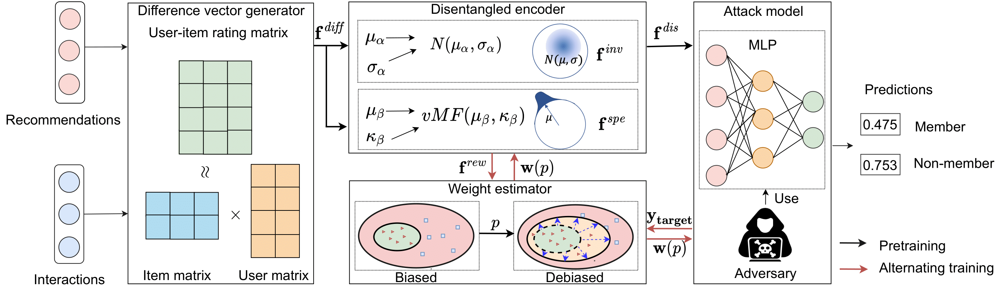
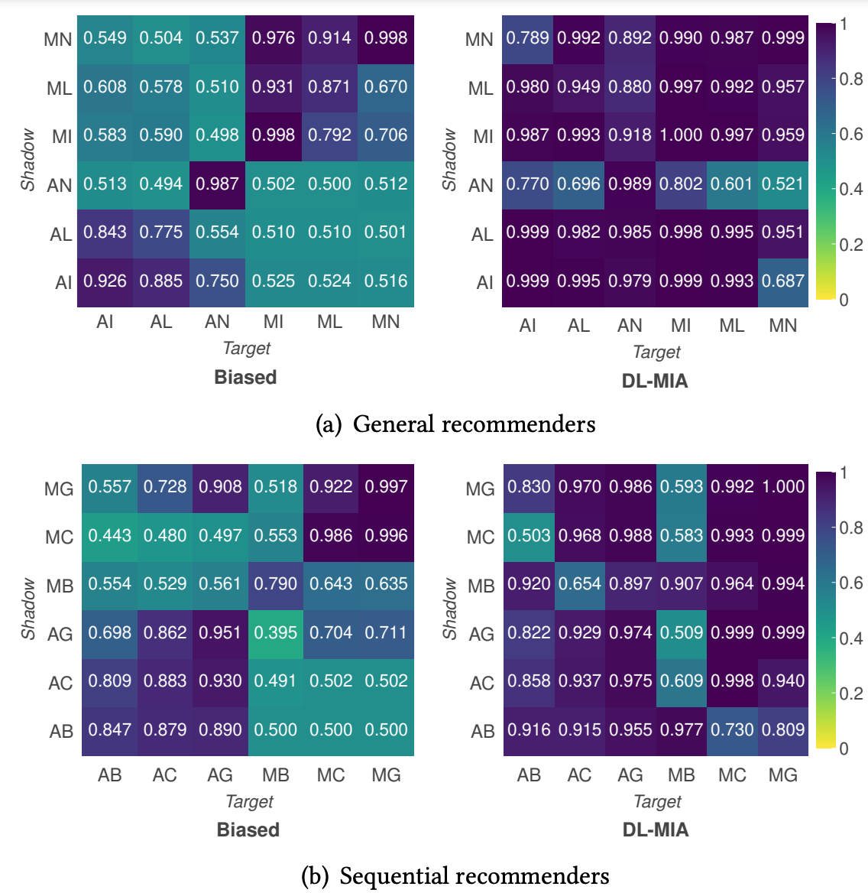

# DL-MIA
This repo is a PyTorch implementation of "[Debiasing Learning for Membership Inference Attacks Against Recommender Systems](https://arxiv.org/pdf/2206.12401.pdf)" (KDD 2022).

## Introduction
State-of-the-art membership inference attacks against recommender systems face two challenging problems: 
1. training data for the attack model is biased due to the gap between shadow and target recommenders, and 
2. hidden states in recommenders are not observational, resulting in inaccurate estimations of difference vectors.

In this paper, the proposed **DL-MIA** framework aims to address above limitations. To mitigate the gap between recommenders, a VAE based `disentangled encoder` is devised to identify recommender invariant and specific features. To reduce the estimation bias, we design a `weight estimator`, assigning a truth-level score for each difference vector to indicate estimation accuracy. 

<div align=center>

</div>

## Main results
We evaluate DL-MIA against both general recommenders and sequential recommenders on three real-world datasets (i.e., `MovieLens-1M`, `Amazon Digital Music`, and `Amazon Beauty`). 

<div align=center>

</div>


## Dependencies

- Python 3.8
- PyTorch 1.7
- NumPy

## Dataset

For dataset preprocessing, please see detailed instructions in [DATASET.md](DATASET.md).

## Run
The following commands can be used to train DL-MIA for sequential recommenders:
```bash
cd DL-MIA/DL-MIA-SR/Joint-Training/SMDD/
sh ACMC.sh
```
Note that [slurm](https://slurm.schedmd.com/documentation.html) configuration commands in ```ACMC.sh``` should be commented out if there is no slurm manager on your server.

## Evaluation

To evaluate trained models, please set ```--is_eval``` in ```ACMC.sh``` to ```1```


## Reference

```
@inproceedings{wang2022Debiasing,
  author    = {Zihan Wang, Na Huang, Fei Sun, Pengjie Ren, Zhumin Chen, Hengliang Luo, Maarten de Rijke, and Zhaochun Ren},
  title     = {Debiasing Learning for Membership Inference Attacks Against Recommender Systems},
  booktitle = {{KDD} '22: The 28th {ACM} {SIGKDD} Conference on Knowledge Discovery and Data Mining, USA, August 14-18, 2022},
  year      = {2022}
}
```
